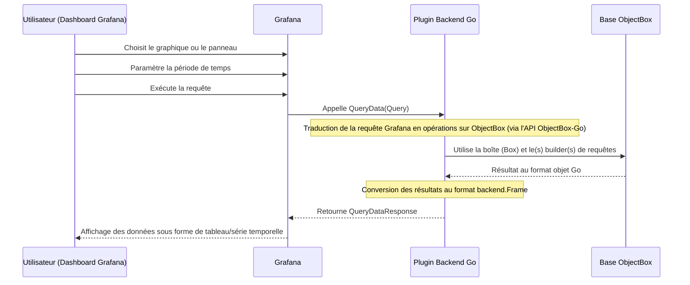

## Objectifs: remplacer victoriametrics ayant une empreinte de 100MB par une autre DB plus legere.

L'idée d'isoler ce plugin est judicieuse, car il pourra être facilement maintenu, testé et déployé indépendamment de votre application Rust. De plus, le SDK Go de Grafana est le standard officiel, ce qui facilite l'accès à une documentation et une communauté solides. Voici un plan de mise en œuvre détaillé pour mener à bien cette intégration.

Plan de mise en œuvre : Plugin de source de données Go pour Grafana

Cette feuille de route détaille la création d'un backend personnalisé reliant les données d'ObjectBox à Grafana.

Phase 1 : Configuration du projet du plugin

L'objectif ici est de générer et de configurer l'environnement de développement.

· Générer un projet avec l'outil officiel : Depuis votre Raspberry Pi 5, exécutez la commande npx @grafana/create-plugin@latest mon-plugin-objectbox. Cette commande va créer la structure de base de votre plugin. Choisissez l'option "Datasource" lorsqu'on vous demande le type de plugin.
· Configurer l'identité du plugin : Modifiez les fichiers plugin.json et package.json pour renseigner l'ID, le nom et la description de votre plugin, par exemple id: "mon-org-objectbox-datasource".
· Installer les dépendances Go : Positionnez-vous dans le dossier du plugin et mettez à jour le SDK Go avec les commandes suivantes :
  ```bash
  go get -u github.com/grafana/grafana-plugin-sdk-go
  go get github.com/objectbox/objectbox-go
  go mod tidy
  ```
  Vous avez maintenant un squelette prêt à être développé.

Phase 2 : Implémentation du backend Go

Cette phase est le cœur du projet, car nous allons connecter la source de données à Grafana.

· Définir les méthodes CRUD dans un service Go dédié : Créez un dossier pkg/objectbox et implémentez-y les fonctions pour vous connecter à la base (objectbox.NewBuilder()...) et exécuter des requêtes (box.Query()...), en utilisant le modèle de données provenant de votre application métier.
· Coder la logique du plugin dans datasource.go : Le cœur du plugin doit gérer les appels de Grafana via les méthodes de l'interface backend.QueryDataHandler. Il faudra ici :
  1. Récupérer la requête.
  2. Interroger ObjectBox (en utilisant le service créé précédemment).
  3. Transformer les résultats au format standard de séries temporelles pour Grafana (backend.DataResponse).

Voici une illustration du cycle de vie d'une requête que votre plugin devra implémenter :



· Déployer le plugin en mode développement : Exécutez npm run server pour lancer Grafana en local (ou utilisez Docker). Une fois connecté, vous pourrez configurer votre nouvelle source de données, indiquer le chemin vers votre fichier ObjectBox et cliquer sur "Save & Test". Le backend devra implémenter la méthode CheckHealth pour valider la connexion.

Phase 3 : Développement de l'application Rust (Application Métier)

Cette phase reste inchangée, le but étant que votre application Rust écrive et lise des données dans une base ObjectBox.

· Modéliser vos données : Définissez vos entités en utilisant les attributs standards d'ObjectBox (comme l'ID) et générez les bindings avec l'outil objectbox.
· Implémenter le CRUD : Intégrez l'API ObjectBox dans votre projet Rust pour gérer les opérations de votre application métier.

Conseils clés pour le développement

Pour un résultat professionnel, voici les aspects à bien maîtriser.

· Schema ID et Bindings : Le numéro UID de vos entités ObjectBox doit être identique entre votre application Rust et le plugin Go. Exportez le fichier objectbox-model.json depuis le plugin Go et importez-le dans votre application Rust, ou vice-versa. Cela garantit la compatibilité des schémas.
· Gestion des erreurs : Le SDK Grafana attend des réponses précises. Implémentez la méthode CheckHealth pour envoyer un statut clair ("OK" ou "ERROR") et des logs pertinents. En cas d'erreur, renvoyez des codes standards dans vos DataResponse.
· Format des données : Le moteur de Grafana est performant pour traiter des séries temporelles au format time.Time suivi d'une valeur numérique. Prenez le temps de bien formater les données (backend.NewFrame) pour une visualisation sans accroc.

Code d'exemple

Voici un extrait pour illustrer la structure de datasource.go (les imports sont omis pour plus de clarté).

```go
// datasource.go
package main

import (
    "context"
    "github.com/grafana/grafana-plugin-sdk-go/backend"
    "github.com/grafana/grafana-plugin-sdk-go/data"
)

type ObjectBoxDatasource struct {
    // Un gestionnaire pour interagir avec votre base
    db *objectbox.ObjectBox
}

// QueryData est l'endroit où la logique de transformation se trouve.
func (ds *ObjectBoxDatasource) QueryData(ctx context.Context, req *backend.QueryDataRequest) (*backend.QueryDataResponse, error) {
    response := backend.NewQueryDataResponse()

    for _, q := range req.Queries {
        // 1. Analysez la requête JSON de Grafana
        var queryModel struct {
            Metric string `json:"metricName"`
        }
        json.Unmarshal(q.JSON, &queryModel)

        // 2. Interrogez ObjectBox (remplacez par votre vraie logique)
        //    results, err := ds.db.Query(...)

        // 3. Construisez le "frame" de données pour Grafana
        frame := data.NewFrame("response")
        frame.Fields = append(frame.Fields, data.NewField("time", nil, []time.Time{time.Now()}))
        frame.Fields = append(frame.Fields, data.NewField("value", nil, []float64{42.0}))

        // 4. Empaquetez la réponse
        response.Responses[q.RefID] = backend.DataResponse{
            Frames: data.Frames{frame},
        }
    }

    return response, nil
}
```

Cette architecture vous garantit une solution claire, maintenable et pérenne. Si vous avez besoin de précisions sur l'un de ces points, je suis à votre disposition.
